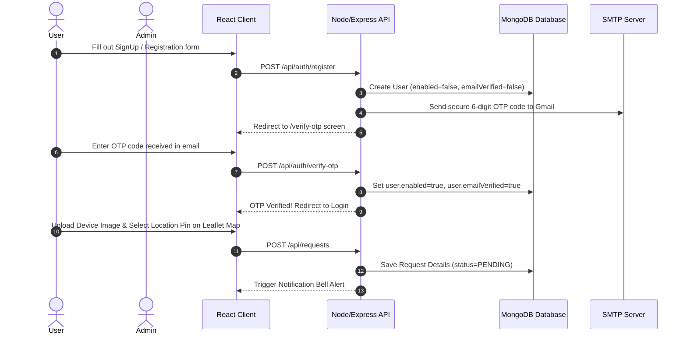

# Smart E-Waste Management System (EcoSync)

A full-stack, enterprise-grade **MERN (MongoDB, Express.js, React, Node.js) Stack** platform designed to streamline and automate the collection, scheduling, and recycling of electronic waste (e-waste). The system integrates modern user registration with Gmail SMTP email OTP verification, secure JWT authentication, real-time map location picking, Cloudinary image uploads, and administrative scheduling.

---

## 1. Project Statement & Outcomes

### The Problem
Improper disposal of electronic items leads to significant environmental hazards. Many citizens are willing to recycle but lack an interactive, reliable, and convenient pickup system, while waste collection agencies struggle with manual verification, schedule coordination, and logistics.

### The Solution
The **Smart E-Waste Collection and Management System (EcoSync)** provides:
* **For Users:** An intuitive, mobile-responsive portal to submit details of defunct electronics, upload device photos to Cloudinary, select precise pickup addresses via an interactive map, and receive real-time notifications.
* **For Admins:** A centralized dashboard displaying real-time metrics, request coordinates, and customer details, allowing admins to approve/reject requests, request better photos, schedule pickup slots with secure Collection OTPs, and manage the system.

---

## 2. Technology Stack

* **Backend:** Node.js, Express.js, Mongoose ODM, MongoDB Atlas (Cloud Database), JWT, bcryptjs, Nodemailer (Gmail SMTP).
* **Frontend:** React 18, Vite, Tailwind CSS, Leaflet Map API (Interactive Location Picker), Lucide Icons, Axios.
* **Storage:** Cloudinary (for secure, persistent image uploads).

---

## 3. Core Modules & Project Working Flow



### User Workflow
1. **Account Setup & Verification:** The user registers on the Register page. The backend generates a secure 6-digit OTP, sends it to the user's Gmail address, and redirects the user to the verification screen. Once verified, the account is activated and the user can log in.
2. **Disposal Request:** The user enters device details, uploads device photos (uploaded persistently to Cloudinary), and uses the interactive Leaflet map picker to drop a coordinate pin.
3. **Real-time Tracking:** The user tracks their request status on their dashboard, views their secure **Collection OTP** (generated upon approval/scheduling, which the collection agent will verify on-site), and receives bell notifications.
4. **View Receipt & Environmental Impact Certificate:** For approved or completed pickups, the user can view and print/save a gorgeous **Green Environmental Impact Certificate** summarizing unit base values, carbon offsets, landfill space saved, and metallic yield statistics.

### Admin Workflow
1. **Dashboard Metrics:** The admin views active requests, status tallies, and user metrics.
2. **Review Details:** The admin inspects the user-submitted photos and details (device type, quantity, address).
3. **Status Changes:** The admin can Approve (`ACCEPTED`), Reject (`REJECTED`), or Request Better Images.
4. **Scheduling Slot:** The admin schedules a pickup date and time. This generates a secure Collection OTP, sends it to the user's email, and pushes real-time notifications to the user's dashboard.

---

## 4. Database Schema Design (MongoDB)

* **`User` Collection:**
  * Stores user profiles, credentials, role tags (`USER`, `ADMIN`), and active state flags.
* **`OtpStore` Collection:**
  * Temporarily stores OTP verification payloads, purpose descriptors, and TTL expiration settings.
* **`EwasteRequest` Collection:**
  * Stores device parameters, quantity, coordinate objects (`pickupLat`, `pickupLng`), images array, status state, scheduling details, and the generated `collectionOtp`.
* **`Notification` Collection:**
  * Stores real-time alert headings, message descriptions, user links, and read/unread flags.

---

## 5. Development Setup & Execution

### Prerequisites
* Node.js v18+
* MongoDB (Local instance or MongoDB Atlas Cloud account)

### Backend Configuration
1. Navigate to the `backend` folder and create a `.env` file:
   ```env
   PORT=8081
   MONGODB_URI=your_mongodb_connection_string
   JWT_SECRET=your_jwt_signature_secret
   MAIL_HOST=smtp.gmail.com
   MAIL_PORT=587
   MAIL_USERNAME=your_gmail_address
   MAIL_PASSWORD=your_gmail_app_password
   CLOUDINARY_CLOUD_NAME=your_cloudinary_cloud_name
   CLOUDINARY_API_KEY=your_cloudinary_api_key
   CLOUDINARY_API_SECRET=your_cloudinary_api_secret
   ```
2. Install dependencies and start the backend:
   ```bash
   cd backend
   npm install
   npm start
   ```

### Database Cleanup Utility
To wipe the database collections and restore a clean, active default Admin account for grading demonstrations, run:
```bash
cd backend
node scripts/cleanDb.js
```
* **Admin Email:** `admin@ewaste.com`
* **Admin Password:** `AdminPassword123`

### Frontend Configuration
1. Install dependencies and start the frontend:
   ```bash
   cd e-waste-system-main
   npm install
   npm run dev
   ```
2. Open `http://localhost:5173/` in your browser. (The app will automatically route requests to `localhost:8081` in development mode).
